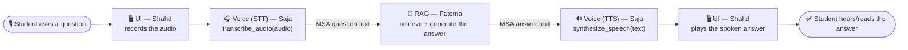

# Project Flow — How Smart Advisor Fits Together

A 5-minute map for the team. Not deeply technical — just "who does what, and where does my
part plug in." For the deep-dive details, see the links at the bottom.

## What Smart Advisor does

A student asks an academic question — by voice or by typing, in Arabic — and gets back an
answer grounded in official UCAS documents, spoken back to them (or shown as text). No
hallucinated answers: if the system isn't confident, it says so instead of guessing.

## The end-to-end flow



The **UI** wraps the whole loop — it captures the recording at the start and plays
the result at the end. Everything in between is one pillar handing a plain value to the next:
audio → text → answer text → audio.

## How the pieces connect

The voice layer is exactly two functions.

```python
from voice import transcribe_audio, synthesize_speech, VoiceError

def voice_loop(audio):
    try:
        question = transcribe_audio(audio).text          # <- Voice: speech to text
    except VoiceError:
        return None, "لم أفهم ما قلته، من فضلك حاول مرة أخرى."  # "I didn't catch that"

    # <<< Fatema's RAG pipeline plugs in right here >>>
    answer_text = fatema_rag_pipeline(question)

    try:
        speech = synthesize_speech(answer_text)           # <- Voice: text to speech
        return speech.audio_path, answer_text
    except VoiceError:
        return None, answer_text   # still show the text even if TTS failed
```

## Mock mode vs real mode

- **Build against mock mode** — it's the default, needs zero setup (no models, no GPU, no API
  key), and returns realistic-shaped fake data instantly. This is what you should develop and
  test against day to day.
- **Flip one env var for real audio**: `VOICE_BACKEND=real`. The exact same code runs — same
  two functions, same return fields, same exceptions — just with real Whisper transcription
  and real spoken audio (Azure or offline Piper) instead of placeholders.
- **The voice models are done and real mode works today.** You don't need to wait for
  anything — build against mock now, flip the switch whenever you want to hear it for real.

## Getting started for teammates

- [ ] Clone the repo
- [ ] Nothing to install for mock mode — `from voice import ...` just works
- [ ] Open and run [`docs/voice_usage_guide.ipynb`](voice_usage_guide.ipynb) top to bottom
- [ ] In your own code: `from voice import transcribe_audio, synthesize_speech, VoiceError`
- [ ] Wrap every call in `try/except VoiceError`
- [ ] Only if you need real audio: `pip install -r requirements-voice.txt` and set the env
      vars described in `src/voice/CONTRACT.md`

## Want more detail?

- [`docs/voice_usage_guide.ipynb`](voice_usage_guide.ipynb) — a runnable, teaching notebook:
  the same examples above, plus async variants and picking a male/female voice.
